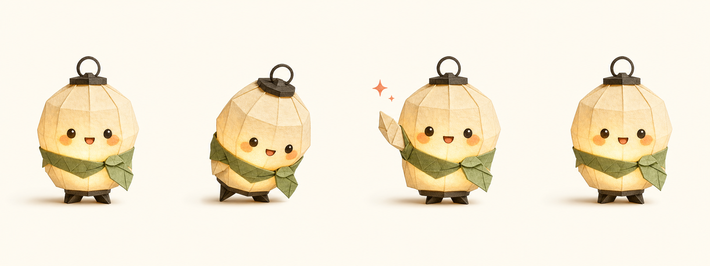

# GIF Stickers / GIF 动态表情包

> 把真人照片、角色图或多帧 sheet 做成微信规格 GIF 表情包，并带验证脚本。

这个 skill 处理“照片/角色参考 → 动态表情包”的完整流水线。它区分保留原照片像素的 B-photo-puppet、只做动字的 B-kinetic-text，以及允许 AI 重绘动作和场景的 A-face-anchor。适合做个人 IP、社群表情、课程老师、AI 讲师、项目发布表情包。

## 示例图

<p><br><sub>纸灯笼动态问候：真实 GIF，已通过微信 240x240 规格验证。</sub></p>
<p><br><sub>1x4 帧表：先锁定角色和动作，再切帧组 GIF。</sub></p>
<p><br><sub>男士商务讲师表情包总览</sub></p>
<p><br><sub>动态预览</sub></p>
<p><br><sub>礼貌问候表情包</sub></p>

## 它能做什么

- 生成微信常用 240x240、循环播放、体积受控的 GIF。
- 从 1x4 / 2x4 多帧 sheet 自动切帧、组 GIF、验证规格。
- 根据需求选择“绝对保脸”还是“动作/场景更丰富但 AI 重绘相似脸”。
- 处理中文 caption、动态文字、预览图、打包 zip。
- 用脚本验证帧数、loop、文件体积和平台规格。

## 安装

把这个仓库克隆到本机 Codex skills 目录：

```bash
mkdir -p ~/.codex/skills
git clone https://github.com/Alexsun1one/gif-stickers.git ~/.codex/skills/gif-stickers
```

如果你的 Agent 使用其它 skills 目录，也可以把包含 `SKILL.md` 的这个仓库复制过去。

## 怎么用

示例请求：

```text
用 gif-stickers 基于这张真人照片做 3 个微信 GIF：早安呀、辛苦啦、谢谢你。先走 A-smoke，不要一上来盲跑完整大包。
```

Skill 入口是 [`SKILL.md`](SKILL.md)。细则在 [`references/`](references/)；如果这个仓库带脚本，脚本在 [`scripts/`](scripts/)。

## 质量要求

- 先服务内容，再服务风格；图必须解释一个具体想法。
- 中文默认要可读，标题、caption、标签不能只当装饰纹理。
- 同一组图要风格统一，但每张图要贴合自己的段落/用途。
- 示例图是工作流参考，不是唯一模板。

## 公众号

更完整的拆解、提示词、案例复盘、AI 写作和产品实践，我会继续写在公众号里。下面是我的真实公众号二维码/搜一搜卡片，不是仿造的装饰二维码。

<p align="center">
  
</p>

## 开源协议

MIT。见 [`LICENSE`](LICENSE)。

## 声明

这是 Sun Wuyuan / Alexsun1one 的原创开源 Skill 包。它不隶属于 OpenAI、GitHub、微信或任何被提及的平台。请不要用它去复制受保护 IP、仿冒在世艺术家，或暗示不存在的品牌背书。
